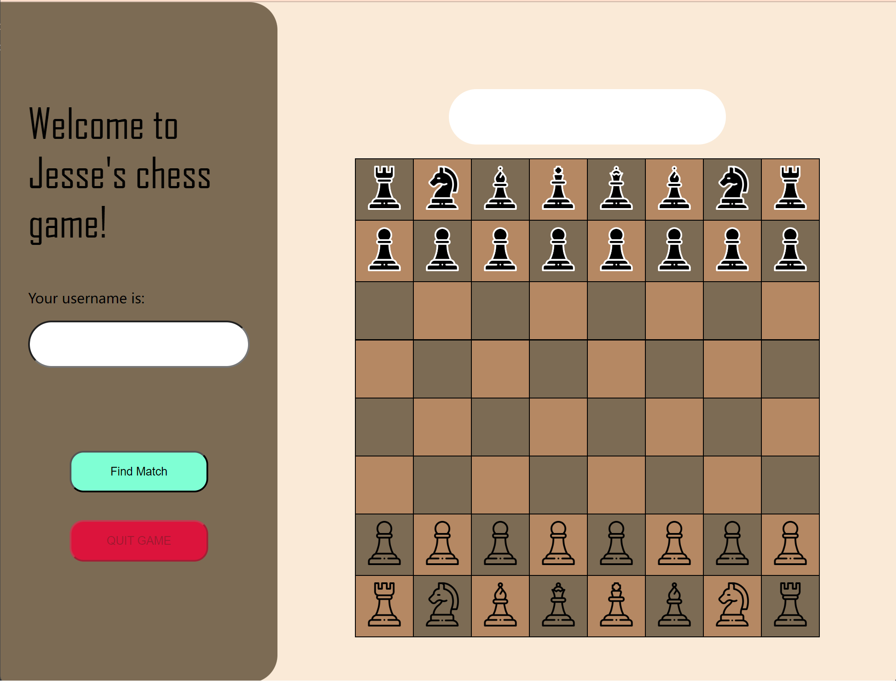

# README

This is another tiny project I completed when studying parallel and distributed computing. It consists of a server application and a client application. The server is written in C#, which implement a multi-threaded game server for two-player games using C# and synchronous server sockets. The client is written in JavaScript, HTML and CSS, which represents a chess game. The requirement detail are as follow:

1. Server Requirements:

   - Do not use high-level APIs like HTTPListener.

   - Communicate with clients using HTTP REST with suggested GET endpoints: /register, /pairme, /mymove, /theirmove, and /quit.

   - Generate and register random usernames for players with /register.

   - Pair players and manage game states with /pairme.

   - Update and fetch players' moves with /mymove and /theirmove, respectively.

   - Handle game termination with /quit.

   - May include additional endpoints for diagnostics or information.

   - Handle errors effectively (e.g., invalid endpoints or parameters).

   - Maintain persistent connections where possible, and gracefully handle disconnections.

   - Use concurrency controls to avoid race conditions.

   - Store information only in memory; it should not persist after server restarts.

   - The server should be a .NET 7 command-line application, runnable without third-party components and support browser-based clients.

   - Log client IP, port number, accessed URL, and thread ID to the console.

2. Client Requirements:

   - Must interact with the server using the provided endpoints.
   - Must pass the registered username in all transactions for identification.
   - Can repeatedly invoke /pairme to check for a paired player.
   - Use /mymove to submit moves and /theirmove to retrieve the opponent's moves during a game.
   - Use /quit to indicate the intention to quit the game.

To improve user experience, I made some adjustments:

1. Combine the operation of registering a username with  the operation of finding a match. 
2. Use interval to automatically find matches and  automatically get opponent's moves. 
3. Highlight the squares a piece can move to with colour  green, in addition, only at the correct moment and only  the pieces that can be moved and highlighted squares  will have click event listener function. 
4. Use a signal box to display game status. The signal box  is above the chess board, and it has four statuses. 
5. Use ‘CurrentDictionary’ to store players information and  active games information. 
6. Use socket to send and receive data.
7. Manually handle incorrect request.

Here is a sample screen-shot of the client application:

